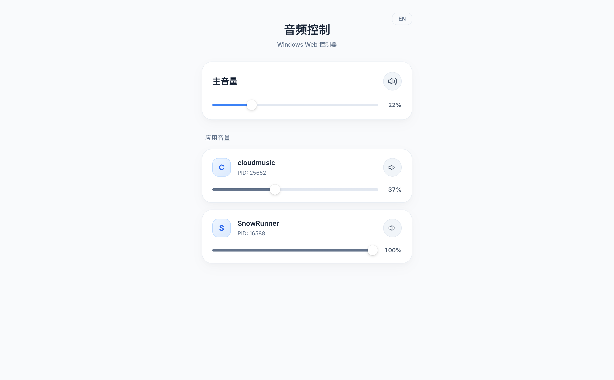

# Windows 音量 Web 控制器

这是一款轻量级、完全无坑、**零依赖**的 Windows 音量控制器。你可以通过手机或局域网内的任何其他设备，在一个美观的现代网页中远程控制 Windows 电脑的“主音量”以及“各个独立应用（如游戏、浏览器、音乐播放器）的音量”。

## 📸 运行效果

由于基于自适应 Web 技术开发，无论是在宽屏的电脑浏览器，还是在竖屏的智能手机上，界面都会自动完美适配。

  

  

## 🚀 如何使用？

1. 前往 GitHub 的 [Releases](../../releases) 页面下载最新的 `.zip` 压缩包。
2. 解压到 Windows 电脑的任意位置。
3. 选择一个版本运行：
   * `winvol.exe`：带有一个黑色的命令行窗口（适合用于调试或看日志）。
   * `winvol_bg.exe`：**后台静默运行版（推荐）**。双击后系统托盘（右下角）会出现一个小图标。
4. 打开连接在同一 WiFi/路由器的手机或其他电脑。
5. 在浏览器中输入：`http://你的电脑局域网IP:8080`（例如 `http://192.168.1.10:8080`）。

## 🛠️ 自己动手编译

如果你想修改代码或加新功能，只需几步即可自己编译这套源码：

1. 确保电脑已安装 [Go 1.21+](https://go.dev/dl/) 环境。
2. 克隆本仓库到本地。
3. 在项目目录下运行 `go mod tidy` 以下载 Core Audio API 控制库。
4. **如果你在 Windows 上**，只需双击项目根目录下的 `build.bat` 脚本，它会自动帮你把带命令行版和后台隐藏版一并编译生成好。

---

## ❓ 常见问题 (FAQ)

### ⚠️ Windows 11 “智能应用控制” 拦截了该程序怎么办？

由于本项目是一款独立的个人开源软件，没有花重金购买企业级 EV 数字签名证书，所以在你首次双击解压出来的 `.exe` 文件时，可能会被 Windows 11 的**智能应用控制 (Smart App Control)** 拦截。

针对这种未知、无签名应用的报毒和拦截问题，你可以参考微软官方出具的帮助文档来了解如何放行：
🔗 [微软官方详细说明：智能应用控制常见问题解答](https://support.microsoft.com/zh-cn/windows/%E6%99%BA%E8%83%BD%E5%BA%94%E7%94%A8%E6%8E%A7%E5%88%B6%E5%B8%B8%E8%A7%81%E9%97%AE%E9%A2%98%E8%A7%A3%E7%AD%94-285ea03d-fa88-4d56-882e-6698afdb7003)

**个人开发者推荐的快捷解决方式：**

1. **解除网络锁定**：右键刚刚下载的 `.exe` 文件 -> 选择“属性” -> 勾选最底部的 **“解除锁定 (Unblock)”** -> 点击确定。
2. **自己本地编译**：你可以直接下载本仓库源码，在你的 Windows 电脑上安装 Go 语言环境后，自己双击运行 `build.bat`。因为是你自己本地系统生成的文件，Windows 往往不再认为它是“存在高风险的外来文件”。
